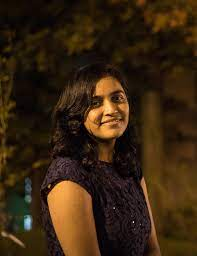

# Mayuna Gupta

  

    📍 San Diego, California 
    📧 <a href="mailto:mayunagupta@gmail.com">mayunagupta@gmail.com</a> 
    🔗 <a href="https://www.linkedin.com/in/mayuna-gupta/">LinkedIn</a> 
    🔗 <a href="https://scholar.google.com/citations?user=1OJyElQAAAAJ&hl=en">Google Scholar</a> 
    🌐 <a href="https://mayunagupta.github.io">Website</a>
  

  

---

## Education

**University of California San Diego**  
*Master's in Electrical and Computer Engineering*  
**Sep 2024 – Jun 2026 (Expected)**

**Indian Institute of Technology Delhi**  
*Bachelor's + Master's of Technology (Dual Degree) in Chemical Engineering*  
**Jun 2016 – Jun 2021**

---

## Skills

  <table style="width:100%; border-collapse:collapse; font-size:15px; box-shadow:0 2px 8px rgba(0,0,0,0.05);">
    <thead>
      <tr style="background:#eaeaea;">
        <th style="border: 1px solid #ccc; padding: 8px; text-align:center;">Category</th>
        <th style="border: 1px solid #ccc; padding: 8px; text-align:center;">Skills</th>
      </tr>
    </thead>
    <tbody>
<tr>
  <td style="border: 1px solid #ccc; padding: 8px; background:#fafbfc;"><b>Programming & Scripting</b></td>
  <td style="border: 1px solid #ccc; padding: 8px;">
    Python &nbsp;,&nbsp; C++ &nbsp;,&nbsp; SQL &nbsp;,&nbsp; Bash &nbsp;,&nbsp; JavaScript &nbsp;,&nbsp; TypeScript
  </td>
</tr>

<tr>
  <td style="border: 1px solid #ccc; padding: 8px; background:#fafbfc;"><b>Core ML & Deep Learning</b></td>
  <td style="border: 1px solid #ccc; padding: 8px;">
    PyTorch &nbsp;,&nbsp; TensorFlow &nbsp;,&nbsp; Keras &nbsp;,&nbsp; Scikit-learn &nbsp;,&nbsp; XGBoost &nbsp;,&nbsp; LightGBM &nbsp;,&nbsp; NumPy &nbsp;,&nbsp; Pandas
  </td>
</tr>

<tr>
  <td style="border: 1px solid #ccc; padding: 8px; background:#fafbfc;"><b>Generative AI & LLMs</b></td>
  <td style="border: 1px solid #ccc; padding: 8px;">
    Transformers &nbsp;,&nbsp; Large Language Models (LLMs) &nbsp;,&nbsp; Vision-Language Models (VLMs) &nbsp;,&nbsp; Hugging Face &nbsp;,&nbsp; LangChain &nbsp;,&nbsp; Retrieval-Augmented Generation (RAG) &nbsp;,&nbsp; FAISS &nbsp;,&nbsp; Agentic AI &nbsp;,&nbsp; Prompt Engineering &nbsp;,&nbsp; Fine-tuning &nbsp;,&nbsp; LoRA &nbsp;,&nbsp; Masked Autoencoders &nbsp;,&nbsp; MCP &nbsp;,&nbsp; Diffusion Models
  </td>
</tr>

<tr>
  <td style="border: 1px solid #ccc; padding: 8px; background:#fafbfc;"><b>Computer Vision & Imaging</b></td>
  <td style="border: 1px solid #ccc; padding: 8px;">
    OpenCV &nbsp;,&nbsp; Scikit-image &nbsp;,&nbsp; CLIP &nbsp;,&nbsp; SAM &nbsp;,&nbsp; Image Segmentation &nbsp;,&nbsp; Object Detection &nbsp;,&nbsp; Multimodal Learning &nbsp;,&nbsp; Medical Imaging &nbsp;,&nbsp; 3D Slicer &nbsp;,&nbsp; Pyradiomics
  </td>
</tr>

<tr>
  <td style="border: 1px solid #ccc; padding: 8px; background:#fafbfc;"><b>Data Engineering & Processing</b></td>
  <td style="border: 1px solid #ccc; padding: 8px;">
    Apache Spark &nbsp;,&nbsp; Hadoop &nbsp;,&nbsp; ETL Pipelines &nbsp;,&nbsp; Data Modeling &nbsp;,&nbsp; Feature Engineering
  </td>
</tr>

<tr>
  <td style="border: 1px solid #ccc; padding: 8px; background:#fafbfc;"><b>Data Visualization</b></td>
  <td style="border: 1px solid #ccc; padding: 8px;">
    Matplotlib &nbsp;,&nbsp; Seaborn &nbsp;,&nbsp; Plotly &nbsp;,&nbsp; Power BI &nbsp;,&nbsp; Tableau &nbsp;,&nbsp; Streamlit &nbsp;,&nbsp; Weights & Biases (WandB)
  </td>
</tr>

<tr>
  <td style="border: 1px solid #ccc; padding: 8px; background:#fafbfc;"><b>MLOps & Deployment</b></td>
  <td style="border: 1px solid #ccc; padding: 8px;">
    Docker &nbsp;,&nbsp; Kubernetes &nbsp;,&nbsp; Git &nbsp;,&nbsp; CI/CD &nbsp;,&nbsp; Linux &nbsp;,&nbsp; MLflow &nbsp;,&nbsp; ONNX &nbsp;,&nbsp; REST APIs &nbsp;,&nbsp; FastAPI &nbsp;,&nbsp; Model Deployment &nbsp;,&nbsp; Experiment Tracking
  </td>
</tr>

<tr>
  <td style="border: 1px solid #ccc; padding: 8px; background:#fafbfc;"><b>Cloud & Infrastructure</b></td>
  <td style="border: 1px solid #ccc; padding: 8px;">
    AWS (SageMaker, S3) &nbsp;,&nbsp; Azure &nbsp;,&nbsp; GCP &nbsp;,&nbsp; SLURM &nbsp;,&nbsp; Distributed Training &nbsp;,&nbsp; Model Parallelism
  </td>
</tr>

<tr>
  <td style="border: 1px solid #ccc; padding: 8px; background:#fafbfc;"><b>Research & Professional Skills</b></td>
  <td style="border: 1px solid #ccc; padding: 8px;">
    Scientific Writing &nbsp;,&nbsp; Literature Review &nbsp;,&nbsp; Experiment Design &nbsp;,&nbsp; Benchmarking &nbsp;,&nbsp; Technical Documentation &nbsp;,&nbsp; Presentation Skills
  </td>
</tr>
    </tbody>
  </table>

---

## Experience

### Graduate Research Fellow — *Schoeneberg Lab*
**Sep 2025 – Mar 2026**
- Developed a scalable deep learning pipeline using **Transformer architectures** to process **terabytes of 4D cellular imaging data**, establishing a novel benchmark for biological significance that improved feature capture by **41%**
- Applied **CLIP-style contrastive learning** to map mitochondrial morphology to mechanistic pathways, achieving **87% Top-3 accuracy** using restricted organelle data
- Built and deployed a **PubChem Retrieval-Augmented Generation (RAG) system** using LangChain for efficient in-lab scientific literature and compound retrieval; used daily by **15+ researchers**

---

### AI Research Engineer — *PlayStation*
**Jun 2025 – Sep 2025**
- Introduced **real-time gameplay understanding** using **Vision–Language Model (VLM) embeddings** via GAME (Game-Aware Multimodal Embeddings), eliminating inference latency through prompt-conditioned multimodal representations
- Designed a **creation and evaluation framework** for multimodal gameplay embeddings, measuring semantic quality, clustering behaviour, and alignment with gameplay experts; achieved **94.8% accuracy** across complex sequences
- Stabilized embedding generation using **prompt randomization strategies**, improving robustness by emphasizing semantic context over lexical variation
- Demonstrated **zero-shot generalization** to unseen game mechanics through Retrieval-Augmented Generation (RAG)-based retrieval of gameplay states

---

### Senior Data Scientist — *Paraxial Healthtech*
**Apr 2024 – Aug 2024**
- Developed an **XGBoost-based texture characterization pipeline** for lung nodule classification using shape, intensity, neighbourhood similarity, segmentation, and gradient features  
  → Achieved **93% classification accuracy**
- Built a **detection and Agatston scoring pipeline** for coronary calcification in non-contrast CT scans
- Reduced compute by **40%** by optimizing lung lobe segmentation with a **pixel-aware crop-and-paste algorithm**

---

### Research Scientist — *IIT Delhi (Prof. Chetan Arora)*
**Jun 2023 – Mar 2024**
- **LQ-Adapter**: Formulated Vision Transformer (ViT) adapters with **learnable queries** for gallbladder cancer (GBC) detection from ultrasound images  
  - Surpassed all state-of-the-art methods with **71.9% mean IoU**
  - Achieved **93.4% classification accuracy** using spatial priors  
  - **Early Acceptance, WACV 2025**
- **FocusMAE**: Designed a self-supervised, interpretable **Video Transformer Masked Autoencoder** framework for early cancer detection from ultrasound videos  
  - Introduced **adaptive foreground masking** using spatial priors from image-based object detection
  - Achieved **96.4% accuracy** with radiologist-approved explainability  
  - **Accepted at CVPR 2024 (Poster)**

---

### Associate Data Scientist — *Gartner*
**Aug 2021 – Jun 2023**
- Spearheaded a **360° client risk identification, tracking, and mitigation workflow** for Gartner's service associates
- Engineered behavioral and interaction-based features to predict churn  
  → **90% recall, 81% AUC**
- Implemented **automated feature selection using Multi-Agent Reinforcement Learning (MARL)**, reducing feature space from 2000+ to 63 business-explainable features  
  → Reduced model rollout time by **50%**
- **Rated Top Performer** in Gartner's Data Science team (2022–2023)

---

### Intern — *Procter & Gamble*
**May 2019 – Jul 2019**
- Designed a roadmap for **Industry 4.0 automation**, improving quality-check efficiency by **150×**
- Evaluated 100+ vendors and achieved **90% cost savings** through localization and proof-of-concept (POC) testing

---

### Intern — *SparroSense*
**May 2018 – Jul 2018**
- Automated transcript generation for client-agent calls through speech-to-text transmission
- Reproduced Facebook AI Research Wav2letter model in PyTorch and TensorFlow, achieving improved speed over the previously deployed DeepSpeech model with a letter error rate of **28%** and word error rate of **40%**

---

## Academic Projects

### Master's Scholar — *IIT Delhi*
**Jul 2019 – Jun 2021**
- Modelled **monsoon intensity prediction** using Sea Surface Temperature (SST) data as a spatiotemporal problem with a **ConvLSTM backbone**
- Achieved **1-year prediction lead time**, outperforming all baselines during major ENSO warm-phase events (1997, 2009, 2015)
- Captured **87% variance** overall; published in *IEEE Geoscience and Remote Sensing Letters (GRSL)*
- Extended prediction lead time to **16 months** using an autoencoder-based ConvLSTM architecture  
  - Captured **99% SST variability** with **91% structural similarity**

---

### Computer Vision & Imaging — *UCSD*
- **Wavelet Denoising:** Implemented a wavelet-guided diffusion model in PyTorch that injects frequency-domain constraints (via discrete wavelet decomposition) into the denoising score, preserving high-frequency structural detail that standard diffusion models smooth away
- **Amodal Segmentation:** Built a latent diffusion pipeline with LMM-conditioned prompt tuning to reconstruct complete object boundaries behind occlusions — enabling perception of object shape even when partially hidden
- **Artistic Motion Blur:** Engineered a physics-inspired deep learning model that induces controllable motion blur by simulating exposure time and camera trajectory, enabling artistic blur without physical re-capture
- **Medical Imaging (CT):** Characterized how CT scanner resolution and slice thickness affect Agatston coronary calcium scores, and derived empirical correction factors to make scores comparable across imaging protocols

### Agentic & NLP Systems — *UCSD*
- **Agentic AI Systems:** Built an autonomous AI agent in Python that generates synthetic electricity bills with realistic usage patterns (seasonal variance, appliance profiles, tariff tiers), enabling LLM benchmarking on domain-specific Q&A tasks where real consumer data is unavailable

### Creative Projects
- **Climbing Gym Coding Curriculum Platform** *(Contributor)* — Contributed to a Next.js/MDX interactive coding curriculum that maps CS concepts to a climbing gym metaphor (routes = lessons, walls = modules), serving UCSD CHEM 199/299 students. Integrated CILogon-based institutional authentication via NextAuth, expanded Python and ML route content, and reworked the climb-up route layout for consistent content ordering across walls

- **Workout Pose Estimation:** Built a real-time workout form correction tool using MediaPipe pose estimation that runs fully locally — accepts any YouTube video (≤2 mins) as input, requires a single camera and no phone, and gives per-rep feedback without sending data to the cloud

---

## Publications

- **LQ-Adapter: ViT-Adapter with Learnable Queries for GBC Detection from Ultrasound Images**  
  *WACV 2025* — Shared First Author  
  🔗 https://arxiv.org/abs/2412.00374

- **FocusMAE: Gallbladder Cancer Detection from Ultrasound Videos with Focused Masked Autoencoders**  
  *CVPR 2024* — Shared First Author  
  🔗 https://arxiv.org/abs/2403.08848

- **GAME: Game-Aware Multimodal Embeddings for Real-Time Gameplay Understanding**  
  *Under Review* — First Author

- **Prediction of ENSO beyond Spring Predictability Barrier using Deep Convolutional LSTM Networks**  
  *IEEE Geoscience and Remote Sensing Letters (GRSL)* — First Author  
  🔗 https://ieeexplore.ieee.org/document/9244083

- **Prediction of Synoptic-Scale Sea Level Pressure over Indian Monsoon Region Using Deep Learning**  
  *IEEE Geoscience and Remote Sensing Letters (GRSL)* — Second Author  
  🔗 https://ieeexplore.ieee.org/document/9507518
